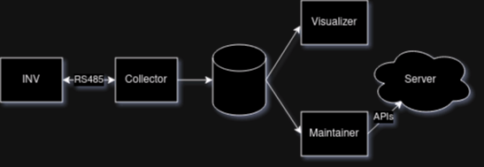

# Modbus Control and Monitoring Framework

This is a comprehensive framework for controlling, monitoring, and visualizing data from Modbus-enabled devices, with a particular focus on Siemens Sinamics V20 inverters. The framework provides robust utilities for data collection, real-time visualization, and maintenance monitoring.

<p align="center">
  
</p>

## Features

- **Modbus Communication**: Robust interface for Modbus RTU protocol communication
- **Data Collection**: Automated data collection and storage in SQLite database
- **Real-time Visualization**: Interactive visualization of motor parameters
- **Maintenance Monitoring**: Automated monitoring of motor performance with alerts
- **Configuration Management**: Flexible configuration through files and environment variables
- **Logging System**: Comprehensive logging for debugging and monitoring
- **Error Handling**: Robust error handling throughout the application

## Project Structure

```
modcon/
├── apps/                     # Application modules
│   ├── collector.py          # Data collection application
│   ├── maintainer.py         # Maintenance monitoring application
│   └── visualizer.py         # Data visualization application
├── models/                   # Machine learning models
├── utils/                    # Utility modules
│   ├── config/               # Configuration utilities
│   │   ├── settings.py       # Configuration management
│   ├── data/                 # Data handling utilities
│   │   ├── collector.py      # Data collection utilities
│   │   ├── file_io.py        # File I/O utilities
│   ├── database/             # Database utilities
│   │   ├── operations.py     # Database operations
│   ├── modbus/               # Modbus communication utilities
│   │   ├── client.py         # Modbus client utilities
│   │   ├── motor.py          # Motor control class
│   │   ├── monitor.py        # Continuous monitoring utilities
│   ├── visualization/        # Visualization utilities
│   │   ├── app.py            # Visualization application
│   │   ├── realtime_plot.py  # Real-time plotting utilities
│   └── logger.py             # Logging utilities
├── tests/                    # Test modules
│   ├── modbus/               # Modbus test modules
│   │   ├── test_motor.py     # Tests for motor controller
├── assets/                   # Static assets
│   ├── data/                 # Data files
│   ├── imgs/                 # Image files
└── data/                     # Database files
```

## Installation

### Prerequisites

- Python 3.8 or higher
- PyModbus
- PyQtGraph
- PyQt5
- SQLite3
- NumPy
- joblib

### Setup

1. Clone the repository:
   ```bash
   git clone https://github.com/yourusername/ monitor-motor.git
   cd  monitor-motor

   ```

2. Install dependencies:
   ```bash
   pip install -r requirements.txt
   ```

3. Set up permissions for serial port (if needed):
   ```bash
   sudo chmod a+rw /dev/ttyUSB0
   ```

## Usage

### Data Collection

To start collecting data from a Modbus device:

```bash
python -m apps.collector
```

Options:
- `--config CONFIG_FILE`: Path to configuration file
- `--interval SECONDS`: Data collection interval in seconds
- `--port PORT`: Modbus serial port
- `--db-path PATH`: Database file path
- `--verbose`: Enable verbose output

### Visualization

To visualize the collected data:

```bash
python -m apps.visualizer
```

Options:
- `--config CONFIG_FILE`: Path to configuration file
- `--interval MS`: Update interval in milliseconds
- `--db-path PATH`: Database file path
- `--points N`: Number of data points to display
- `--verbose`: Enable verbose output

### Maintenance Monitoring

To monitor motor performance and receive alerts:

```bash
python -m apps.maintainer
```

Options:
- `--config CONFIG_FILE`: Path to configuration file
- `--interval SECONDS`: Monitoring interval in seconds
- `--db-path PATH`: Database file path
- `--model-path PATH`: Path to ML model file
- `--verbose`: Enable verbose output

## Configuration

ModCon can be configured through:

1. Configuration files (JSON format)
2. Environment variables
3. Command-line arguments

Example configuration file:

```json
{
  "modbus": {
    "port": "/dev/ttyUSB0",
    "method": "rtu",
    "baudrate": 9600,
    "slave_id": 2
  },
  "database": {
    "path": "data/inverter.db",
    "table_name": "sinamicv20"
  },
  "collector": {
    "interval": 1.0
  },
  "visualization": {
    "update_interval": 50,
    "n_points": 100
  }
}
```

## Testing

To run the tests:

```bash
python -m tests.modbus.test_motor
```

## References

- [CSV-viewer](https://csv-viewer-online.github.io/)
- [pymodbus Documentation](https://pymodbus.readthedocs.io/en/latest/source/readme.html)
- [Sqlite-viewer](https://inloop.github.io/sqlite-viewer/)
- [Modpoll Modbus Master Simulator](https://www.modbusdriver.com/modpoll.html)
- [Anomaly detection in multivariate time series](https://www.kaggle.com/code/drscarlat/anomaly-detection-in-multivariate-time-series)
- [Siemens Sinamics V20 inverter with MODBUS communication for IoT without PLC](https://www.youtube.com/watch?v=pRJo0vXLvzU)
- [SQLite Database with Python: How to Create Tables, Insert Data, and Run Queries](https://www.youtube.com/watch?v=ZQAnkjfvZAw)
- [Anomaly detection in time series with Python](https://www.youtube.com/watch?v=qy41dXGbAxY)
- [Read & Write Holding Register of Modbus RTU or Serial Device Using Python](https://www.youtube.com/watch?v=pLecgMoB-dA)

## License

This project is licensed under the MIT License - see the LICENSE file for details.

## Contributing

Contributions are welcome! Please feel free to submit a Pull Request.
